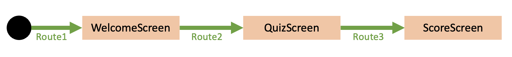

# Navigation

##  🧪 Create Navigation between composable screens 

Android Jetpack navigation enable navigation with navigation host

### Add  dependency to your project

::: details libs.versions.toml
``` sh
navigation = "2.7.7"
...
androidx-navigation = { group = "androidx.navigation", name = "navigation-compose", version.ref = "navigation" }
```
::: 

::: details build.gradle.kts (module:app)
``` kotlin
...
dependencies {
...
    implementation(libs.androidx.navigation)
...
```
::: 

### Create your navigation host 

The navigation host is the configuration class that defines routes 
of your application. 

Routes are path between all the composable screens that you will call later on your app.




For this Hands-on Lab we need 3 routes for : 
* At startup to the `WelcomeScreen`
* from Welcome screen to the `QuizScreen`
* from the final question `QuizScreen`to the `ScoreScreen` 

::: details Navhost.kt
```kotlin
private lateinit var quizRepository: QuizRepository // Assuming QuizRepository is defined elsewhere

@Composable
 fun RootNavHost(context: Context){
    val navController = rememberNavController()
    quizRepository = QuizRepository(context) // Initialize quizRepository

    NavHost(navController, startDestination = "welcome") {
        composable(
            route = "welcome",
            // arguments = emptyList() // If there are no arguments
        ) {
            WelcomeScreen(navController)
        }
        composable(
            route = "quiz",
        ) {
            val questions = quizRepository.questionState.collectAsState()
            if (questions.value.isNotEmpty()) {
                QuestionScreen(navController,questions.value)
            }
        }
        composable(
            route = "score/{score}",
            arguments = listOf(navArgument("score") { type = NavType.StringType })
        ) { backStackEntry ->
            val score = backStackEntry.arguments?.getString("score")
            score?.let { ScoreScreen(navController,it) }
        }
    }
}
```
::: 

::: warning

As you can see all composables now take as parameter a navigation controller.
It will be needed to navigate with routes between screens.

for example, the `WelcomeScreen` composable is now declared as follows :

```kotlin
@Composable()
 fun welcomeScreen(navController: NavController){
    ...
```
:::


### Use the navigation host

#### instantiate the navHost on the App main composable.

::: details MainActivity.kt  

```kotlin
class MainActivity : ComponentActivity() {
    override fun onCreate(savedInstanceState: Bundle?) {
        super.onCreate(savedInstanceState)
        enableEdgeToEdge()
        setContent {
            QuizAppAndroidTheme {
                val navController = rememberNavController()
                RootNavHost(applicationContext)
            }
        }
    }
}
```
:::

Because the `WelcomeScreen` was set as initialRoute, it will start correctly the quizz

#### Use the `navigationController`on screen buttons click

::: details WelcomeScreen.kt 
```kotlin
...
Button(
    modifier = Modifier.padding(all = 10.dp),
    onClick = { navController.navigate("quiz") }
) {
    Text("Start the Quizz")
}
...
```

*QuestionScreen.kt* 
```kotlin
...
Button(
    modifier = Modifier.padding(bottom = 20.dp),
    onClick = {
        if(selectedAnswer == questions[questionProgress].correctAnswerId) {
            score++ // Increment the score when answer is correct
        }
        if (questionProgress < questions.size - 1) {
            questionProgress++ // Case 1 : Still some questions
            selectedAnswer = 1 // -> recompose QuizQuestion
        }else{
            // Case 2 : no more questions
            // -> navigate to score screen
            navigator.navigate("score/$score out of ${questions.size}")
        }
}
...
```
:::

::: details ScoreScreen.kt
```kotlin
...
Button(
    modifier = Modifier.padding(all = 20.dp),
    onClick = {
        navigator.navigate(route = "quiz")
    }
) {
    Icon(Icons.Filled.Refresh, contentDescription = "Localized description")
    Text(text = "Retake the Quizz",)
}
...
```
:::


## 🎯 Solutions

::: tip
The full sources can be retrieved [here](#) 
:::


**✅ If everything is fine,  congrats, you've just finish this codelab. You can now experiment your kotlin skills eveywhere !**

## 📖 Further reading
- [Animation in compose cheat sheet](https://storage.googleapis.com/android-stories/compose/Compose_Animation_Cheat_Sheet.pdf)
- [The accompagnist : a group of libraries that aim to supplement Compose](https://google.github.io/accompanist/)

