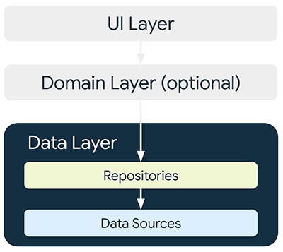

# Connectivity

Let's connect our Quiz app to internet. 

## 📚 Architecture  

:::tip Architecture basics
**Everything You NEED to Know About Client Architecture Patterns**
<iframe width="560" height="315" src="https://www.youtube.com/embed/I5c7fBgvkNY" title="Everything You NEED to Know About Client Architecture Patterns" frameborder="0" allow="accelerometer; autoplay; clipboard-write; encrypted-media; gyroscope; picture-in-picture" allowfullscreen></iframe>
:::

### Data layer for Android

Data layer is provided by [Android Architecture pattern](https://developer.android.com/topic/architecture/data-layer)



Repository classes are responsible for the following tasks:
  * Exposing data to the rest of the app.
  * Centralizing changes to the data.
  * Resolving conflicts between multiple data sources.
  * Abstracting sources of data from the rest of the app.
  * Containing business logic.

### [Kotlin flow](https://kotlinlang.org/api/kotlinx.coroutines/kotlinx-coroutines-core/kotlinx.coroutines.flow/-flow/)

"A flow is an asynchronous data stream that sequentially emits values and completes normally or with an exception."

There are multiple types of flow, for the Hands-on Lab, we will focus on [`StateFlow`](https://kotlinlang.org/api/kotlinx.coroutines/kotlinx-coroutines-core/kotlinx.coroutines.flow/-state-flow/)

A state flow is a hot flow because its active instance exists independently of the presence of collectors (our composables that consume the data)

### [Coroutine](https://kotlinlang.org/docs/coroutines-basics.html#your-first-coroutine)

"A coroutine is an instance of suspendable computation. It is conceptually similar to a thread, in the sense that it takes a block of code to run that works concurrently with the rest of the code. However, a coroutine is not bound to any particular thread. It may suspend its execution in one thread and resume in another one."


###  🧪 Create your first DataSource and Repository

* Create a mock datasource, that generate a list of question
* Use it with a repository on your QuizScreen

::: warning 
We will skip for now the UI state holder layer such as [`ViewModels`] to make a simple architecture
:::details architecture

:::

 ### 🎯 Solutions

::: details MockDataSource.kt
``` kotlin 
package network

import network.data.Answer
import network.data.Question

class MockDataSource {

    suspend fun generateDummyQuestionsList():List<Question>{
        return generateQuestionsList()
    }
    fun generateQuestionsList():List<Question>{
        return listOf(
            Question(
                1,
                "Android is a great platform ?",
                1,
                listOf(
                    Answer( 1,"YES"),
                    Answer(2,"NO")
                )
            ),
            Question(
                1,
                "Android is a bad platform ?",
                2,
                listOf(
                    Answer( 1,"YES"),
                    Answer(2,"NO")
                )
            )
        )

    }

}
```
:::

::: details  QuizRepository.kt
``` kotlin
package network

class QuizRepository(sqlDriver: SqlDriver)  {

    private val mockDataSource = MockDataSource()
    private val coroutineScope = CoroutineScope(Dispatchers.Main)
    private var _questionState=  MutableStateFlow(listOf<Question>())
    var questionState = _questionState

    init {
        updateQuiz()
    }

    private fun updateQuiz(){
        coroutineScope.launch {
            _questionState.update {
                    mockDataSource.generateDummyQuestionsList()
            }
        }
    }
}
```
:::

## Connect my Quizz to the internet

For now, we will request a simple plain text json file hosted on this repo that will simulate a REST API call to be able to use our Ktor client.

The request & answers details are specified below :

::: details Request
```bash
POST
content-type: text/plain  
url: https://github.com/worldline/learning-kotlin-multiplatform/raw/main/quiz.json
```
::: 

::: details Answer
```bash
code:200
body: 
{
  "questions": [
    { 
    "id":1, 
    "label":"You can create an emulator to simulate the configuration of a particular type of Android device using a tool like", 
    "correct_answer_id":3, 
    "answers":[
      {"id":1, "label":"Theme Editor"},
      {"id":2, "label":"Android SDK Manager"},
      {"id":3, "label":"AVD Manager"},
      {"id":4, "label":"Virtual Editor"}
     ]
    },
    {
    "id":2, 
    "label":"What parameter specifies the Android API level that Gradle should use to compile your app?", 
    "correct_answer_id":2, 
    "answers":[
      {"id":1, "label":"minSdkVersion"},
      {"id":2, "label":"compileSdkVersion"},
      {"id":3, "label":"targetSdkVersion"},
      {"id":4, "label":"testSdkVersion"}
     ]
    },
  ]
}
```
::: 

To not overcomplexify the app, let's assume that :
  * the QuizAPI provided by Ktor (cf below) is our data source
  * the repository will use a state flow that emit the API answer once at application startup


###  🧪 Ktor as a multiplatform HTTP client

Ktor includes a multiplatform asynchronous HTTP client, which allows you to make requests and handle responses, extend its functionality with plugins, such as authentication and JSON deserialization. 

#### Add global dependencies

Shared sources need it to use ktor library on your code

::: details build.gradle.kts (module : shared) 

*libs.versions.toml*
``` kotlin
ktor = "2.3.4"

[libraries]
ktor-client-android = { group = "io.ktor", name = "ktor-client-android", version.ref  = "ktor" }
ktor-client-content-negotiation = { group = "io.ktor", name = "ktor-client-content-negotiation", version.ref  = "ktor" }
ktor-serialization-kotlinx-json = { group = "io.ktor", name = "ktor-serialization-kotlinx-json", version.ref  = "ktor" }
ktor-client-serialization = { group = "io.ktor", name = "ktor-client-serialization", version.ref  = "ktor"}
```
::: 

*build.gradle.kts (app)*
```kotlin
dependencies {
    ...
    implementation(libs.ktor.client.android)
    implementation(libs.ktor.client.serialization)
    implementation(libs.ktor.serialization.kotlinx.json)
    implementation(libs.ktor.client.content.negotiation)
```


#### Enable Internet permissions 

You need to enable internet  otherwise you will not be able to use ktor client

::: details AndroidManifest.xml
```xml
    <uses-permission android:name="android.permission.INTERNET" />
    <uses-permission android:name="android.permission.ACCESS_NETWORK_STATE" />
```
::: 

#### Create the API client 

::: details network.QuizApiDatasource.kt  
``` kotlin
package network

class QuizApiDatasource {
    private val httpClient = HttpClient {
        install(ContentNegotiation) {
            json(
                contentType = ContentType.Text.Plain, // because Github is not returning an 'application/json' header
                json = Json {
                ignoreUnknownKeys = true
                useAlternativeNames = false
            })
        }
    }
    suspend fun getAllQuestions(): Quiz {
        return httpClient.get("https://awl.li/devoxxkmm2023").body()
    }
}
```
::: 
#### Make all your dataclass become serializable

Ktor need it to transform the json string into your dataclasses

::: details Quiz.kt  
``` kotlin
@kotlinx.serialization.Serializable
data class Quiz(var questions: List<Question>)
```
::: 

::: details Question.kt  (SourceSet : commonMain)
```kotlin
import kotlinx.serialization.SerialInfo
import kotlinx.serialization.SerialName

@kotlinx.serialization.Serializable
data class Question(val id:Int, val label:String, @SerialName("correct_answer_id") val correctAnswerId:Int, val answers:List<Answer>)
```
::: 

::: details Answer.kt  
```kotlin
@kotlinx.serialization.Serializable
data class Answer(val id: Int, val label: String )
```
:::

 #### Create your Repository class in `commonApp`

::: details QuizRepository.kt 
```kotlin
class QuizRepository()  {

    private val quizApiDatasource = QuizApiDatasource()
    private val coroutineScope = CoroutineScope(Dispatchers.IO)

    private var _questionState=  MutableStateFlow(listOf<Question>())
    var questionState = _questionState

    init {
        updateQuiz()
    }

    private suspend fun fetchQuiz(): List<Question> = quizApiDatasource.getAllQuestions().questions

    private fun updateQuiz(){

        coroutineScope.launch {
            _questionState.update { fetchQuiz() }
        }
    }
}
```
::: 
#### Use the repository 

Replace mocked data for questions by the repository flow.

::: details MainActivity.kt 
```kotlin
...
private val repository = QuizRepository()
...
class MainActivity : ComponentActivity() {
    override fun onCreate(savedInstanceState: Bundle?) {
        super.onCreate(savedInstanceState)
        enableEdgeToEdge()
        setContent {
            QuizAppAndroidTheme {
                 val questions = repository.questionState.collectAsState()

                 if(questions.value.isNotEmpty()) {
                    questionScreen(questions.value)
                 }
            }
        }
    }
}
```
:::

### 🎯 Solutions

::: tip
The full sources can be retrieved [here](#) 
:::


## Image loading from internet 

::: warning Under Construction

:::


An that's it, you quiz have now a remote list of questions.
If you want to get navigation between your WelcomeScreen, QuizScreen and ScoreScreen,
go to the next section →

**✅ If everything is fine, go to the next chapter →**


## 📖 Further reading
- [Ktor client website](https://ktor.io/docs/getting-started-ktor-client.html)
- [Coroutine documentation](https://kotlinlang.org/docs/coroutines-overview.html)
- [REST API basics](https://www.youtube.com/watch?v=-mN3VyJuCjM&list=WL&index=3)


