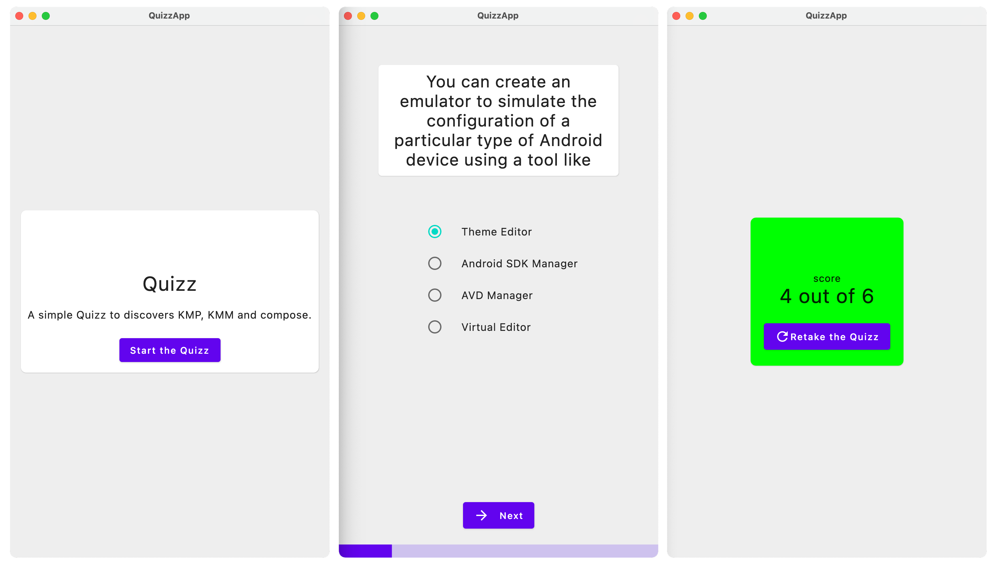

# 🚀 Let's start

## Prerequisites

- Basic knowledge of kotlin development (nullability,inline & lambda functions mainly). For more information, please refer to the [Worldline kotlin training](https://worldline.github.io/learning-kotlin/)
- [Android Studio IDE](https://developer.android.com/studio) with latest stable version **Giraffe** version or above 
- A good connectivity

## Hands-on Lab objectives

### Functionnally

We will create a simple quiz application that provides :
- a Startup screen explaining rules of the game
- a Quiz screen looping on single choices questions
- a final scoring screen.

### Technically

- The app can be deployed on Android , iOS and jvm Desktop.
- We will use not only a common library but composable views shared for all platforms

### Design screens

Here are expected screens at the end of this Hands-on Lab.

::: tip
You can generate composables based on designs on Figma thanks to the plugin [Google Relay](https://www.figma.com/community/plugin/1041056822461507786/Relay-for-Figma). A dedicated section on android developer documentation describe all the steps [here](https://developer.android.com/jetpack/compose/tooling/relay?hl=fr)
:::

# See also

- [Github repository for this training](https://github.com/gbrah/learning-android)
- [Compose/Gradle compatibility guide ](https://www.jetbrains.com/help/kotlin-multiplatform-dev/compose-compatibility-and-versioning.html)
- [AGP/ Android studio compatibility guide ](https://developer.android.com/studio/releases?hl=fr#android_gradle_plugin_and_android_studio_compatibility)
- [Figma Now in android](https://www.figma.com/community/file/1164313362327941158/now-in-android-case-study)
- [Kotlin EDUCATION](https://kotlinlang.org/education/)
